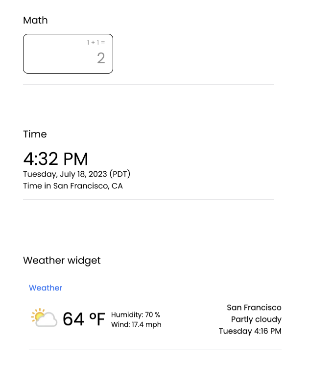

# Widgets

Give immediate and accurate answers to common queries using widgets.

#### Installation

```bash
python3 -m venv ./venv
source ./venv/bin/activate
pip install -r requirements.txt
```

#### Usage

```bash
export FLASK_APP=serve.py; export FLASK_ENV=development; flask run
```

#### Structure 
```bash
+-- serve.py # entry to flask 
+-- gpt.py # utils for gpt
|   +-- widgets 
|   |   +-- core.py # core logic 
|   +-- prompts 
|   |   +-- classifier.yaml 
```

#### Implementation 

1. User asks a question
2. LLM classifies question into a widget label 
3. If supported, LLM gets params to evaluate widget
4. Widget evalutes params which could be an api call or function call
5. Widget returns answer to client 

#### Widgets
